# Cricbuzz Cricket Match Simulation - Reorganized UML Diagrams

## 1. Complete System - Class Diagram (Organized by Layers)

```mermaid
classDiagram
    %% ========== PRESENTATION LAYER ==========
    class Demo {
        +main(args: String[])$
        -addTeam(name: String): Team
        -addPlayer(name: String, type: PlayerType): PlayerDetails
    }
    
    %% ========== MATCH MANAGEMENT LAYER ==========
    class Match {
        -Team teamA
        -Team teamB
        -Date matchDate
        -String venue
        -Team tossWinner
        -InningDetails[] innings
        -MatchType matchType
        +Match(teamA, teamB, matchDate, venue, matchType)
        +startMatch()
        -toss(teamA, teamB): Team
    }
    
    class MatchType {
        <<interface>>
        +noOfOvers(): int*
        +maxOverCountBowlers(): int*
    }
    
    class T20Match {
        +noOfOvers(): int
        +maxOverCountBowlers(): int
    }
    
    class OneDayMatch {
        +noOfOvers(): int
        +maxOverCountBowlers(): int
    }
    
    %% ========== INNING MANAGEMENT LAYER ==========
    class InningDetails {
        -Team battingTeam
        -Team bowlingTeam
        -MatchType matchType
        -List~OverDetails~ overs
        +InningDetails(battingTeam, bowlingTeam, matchType)
        +start(runsToWin)
        +getTotalRuns(): int
    }
    
    class OverDetails {
        -int overNumber
        -List~BallDetails~ balls
        -int extraBallsCount
        -PlayerDetails bowledBy
        +OverDetails(overNumber, bowledBy)
        +startOver(battingTeam, bowlingTeam, runsToWin): boolean
    }
    
    class BallDetails {
        +int ballNumber
        +BallType ballType
        +RunType runType
        +PlayerDetails playedBy
        +PlayerDetails bowledBy
        +Wicket wicket
        -List~ScoreUpdaterObserver~ scoreUpdaterObserverList
        +BallDetails(ballNumber)
        +startBallDelivery(battingTeam, bowlingTeam, over)
        -notifyUpdaters(ballDetails)
        -getRunType(): RunType
        -isWicketTaken(): boolean
    }
    
    %% ========== TEAM MANAGEMENT LAYER ==========
    class Team {
        +String teamName
        +Queue~PlayerDetails~ playing11
        +List~PlayerDetails~ bench
        +PlayerBattingController battingController
        +PlayerBowlingController bowlingController
        +boolean isWinner
        +Team(teamName, playing11, bench, bowlers)
        +chooseNextBatsMan()
        +chooseNextBowler(maxOverCount)
        +getStriker(): PlayerDetails
        +getCurrentBowler(): PlayerDetails
        +getTotalRuns(): int
        +printBattingScoreCard()
        +printBowlingScoreCard()
    }
    
    class PlayerBattingController {
        -Queue~PlayerDetails~ yetToPlay
        -PlayerDetails striker
        -PlayerDetails nonStriker
        +PlayerBattingController(playing11)
        +getNextPlayer()
        +getStriker(): PlayerDetails
        +setStriker(player)
        +getNonStriker(): PlayerDetails
        +setNonStriker(player)
    }
    
    class PlayerBowlingController {
        -Deque~PlayerDetails~ bowlersList
        -Map~PlayerDetails,Integer~ bowlerVsOverCount
        -PlayerDetails currentBowler
        +PlayerBowlingController(bowlers)
        -setBowlersList(bowlers)
        +getNextBowler(maxOverCount)
        +getCurrentBowler(): PlayerDetails
    }
    
    %% ========== PLAYER LAYER ==========
    class PlayerDetails {
        +Person person
        +PlayerType playerType
        +BattingScoreCard battingScoreCard
        +BowlingScoreCard bowlingScoreCard
        +PlayerDetails(person, playerType)
        +printBattingScoreCard()
        +printBowlingScoreCard()
    }
    
    class Person {
        +String name
        +int age
        +String address
    }
    
    class BattingScoreCard {
        +int totalRuns
        +int totalBallsPlayed
        +int totalFours
        +int totalSix
        +double strikeRate
        +Wicket wicketDetails
    }
    
    class BowlingScoreCard {
        +int totalOversCount
        +int runsGiven
        +int wicketsTaken
        +int noBallCount
        +int wideBallCount
        +double economyRate
    }
    
    %% ========== OBSERVER PATTERN LAYER ==========
    class ScoreUpdaterObserver {
        <<interface>>
        +update(ballDetails: BallDetails)*
    }
    
    class BattingScoreUpdater {
        +update(ballDetails: BallDetails)
    }
    
    class BowlingScoreUpdater {
        +update(ballDetails: BallDetails)
    }
    
    %% ========== DOMAIN MODELS ==========
    class Wicket {
        +WicketType wicketType
        +PlayerDetails takenBy
        +OverDetails overDetail
        +BallDetails ballDetail
        +Wicket(wicketType, takenBy, overDetail, ballDetail)
    }
    
    %% ========== ENUMERATIONS ==========
    class BallType {
        <<enumeration>>
        NORMAL
        WIDEBALL
        NOBALL
    }
    
    class RunType {
        <<enumeration>>
        ZERO
        ONE
        TWO
        THREE
        FOUR
        SIX
    }
    
    class PlayerType {
        <<enumeration>>
        BATSMAN
        BOWLER
        WICKETKEEPER
        CAPTAIN
        ALLROUNDER
    }
    
    class WicketType {
        <<enumeration>>
        RUNOUT
        BOLD
        CATCH
    }
    
    %% ========== RELATIONSHIPS ==========
    %% Presentation to Match
    Demo ..> Match : creates
    Demo ..> Team : creates
    
    %% Match Layer Relationships
    Match o-- Team : has 2
    Match o-- InningDetails : has 2
    Match --> MatchType : uses
    MatchType <|.. T20Match : implements
    MatchType <|.. OneDayMatch : implements
    
    %% Inning Layer Relationships
    InningDetails --> Team : batting/bowling
    InningDetails o-- OverDetails : contains
    InningDetails --> MatchType : uses
    OverDetails o-- BallDetails : has 6
    OverDetails --> PlayerDetails : bowler
    
    %% Ball Relationships
    BallDetails --> PlayerDetails : playedBy/bowledBy
    BallDetails --> BallType : uses
    BallDetails --> RunType : uses
    BallDetails o-- Wicket : may have
    BallDetails o-- ScoreUpdaterObserver : notifies
    
    %% Team Relationships
    Team *-- PlayerBattingController : has
    Team *-- PlayerBowlingController : has
    Team o-- PlayerDetails : has 11
    PlayerBattingController --> PlayerDetails : manages
    PlayerBowlingController --> PlayerDetails : manages
    
    %% Player Relationships
    PlayerDetails *-- Person : has
    PlayerDetails --> PlayerType : is a
    PlayerDetails *-- BattingScoreCard : has
    PlayerDetails *-- BowlingScoreCard : has
    
    %% Score Card Relationships
    BattingScoreCard o-- Wicket : may have
    
    %% Wicket Relationships
    Wicket --> WicketType : uses
    Wicket --> PlayerDetails : taken by
    Wicket --> OverDetails : occurred in
    Wicket --> BallDetails : occurred on
    
    %% Observer Pattern Relationships
    ScoreUpdaterObserver <|.. BattingScoreUpdater : implements
    ScoreUpdaterObserver <|.. BowlingScoreUpdater : implements
    BattingScoreUpdater ..> BattingScoreCard : updates
    BowlingScoreUpdater ..> BowlingScoreCard : updates
```

---

## 2. Sequence Diagram - Complete Match Flow (Fixed)

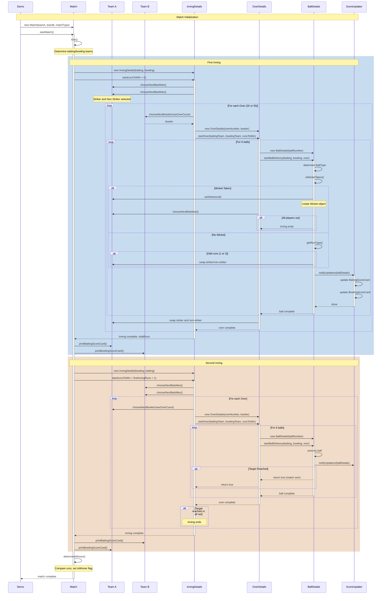

---

## 3. Observer Pattern - Score Update Flow

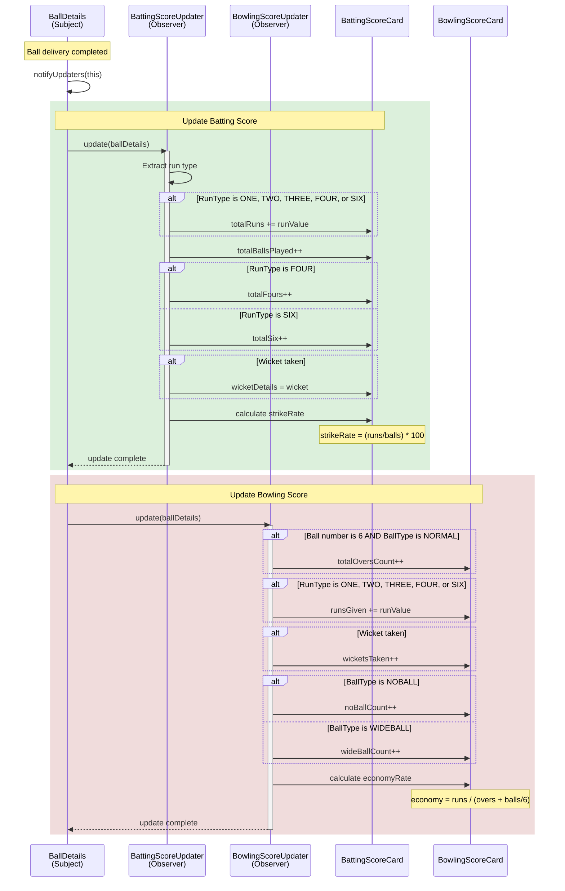

---

## 4. Strategy Pattern - Match Type

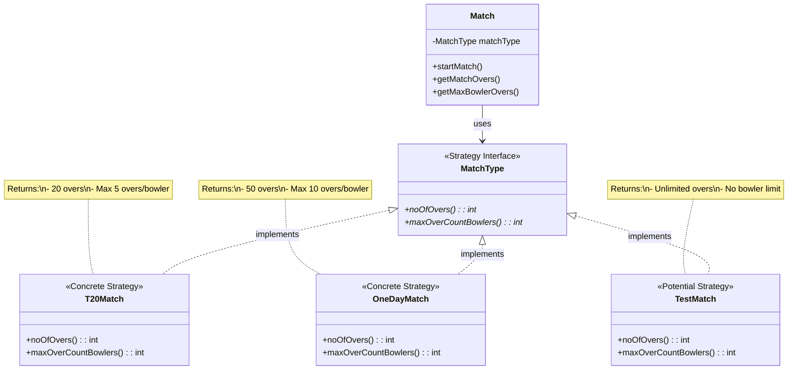

---

## 5. System Architecture - Layered View

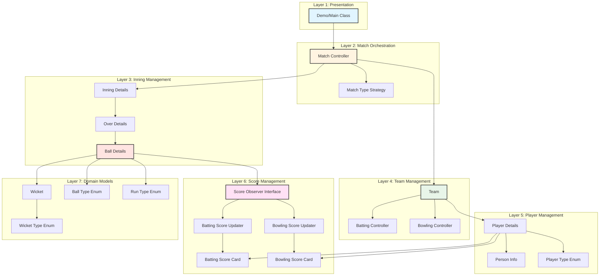

---

## 6. Ball Delivery State Machine

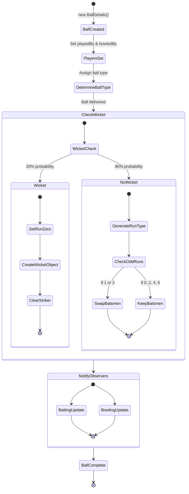

---

## 7. Over Completion Flow

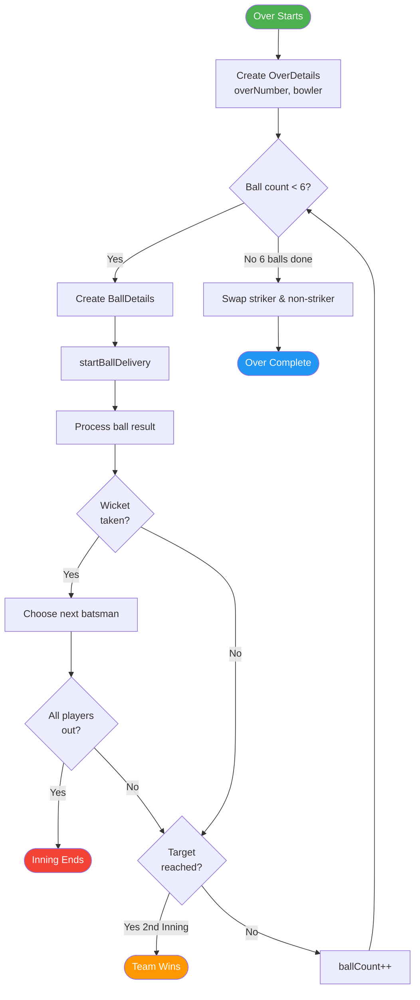

---

## 8. Team Structure Diagram

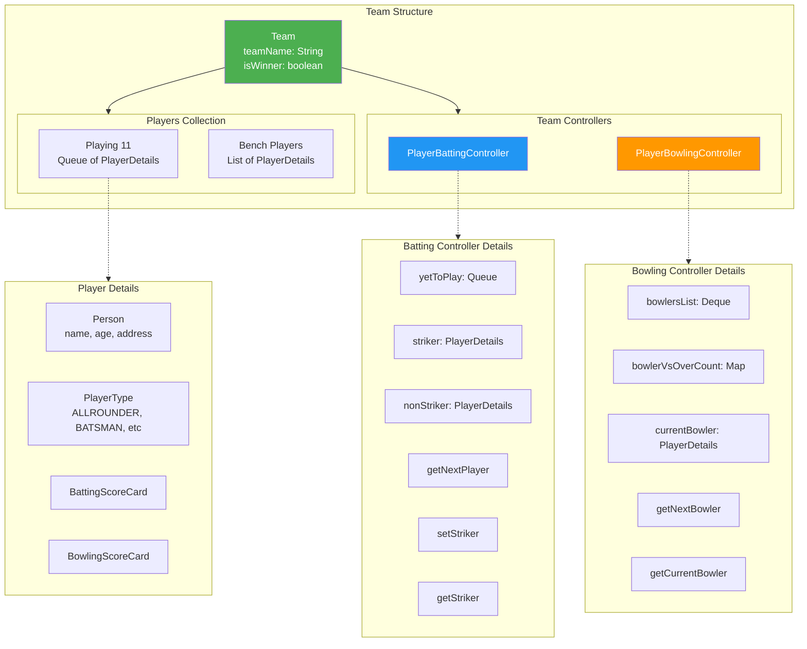

---

## 9. Match State Flow Diagram

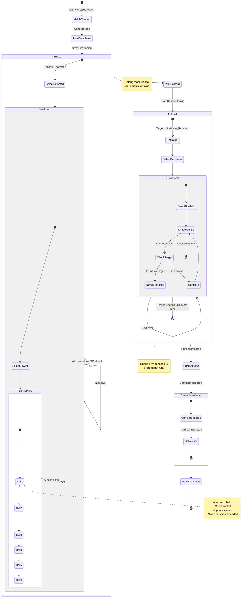

---

## 10. Observer Pattern - Detailed Class Structure

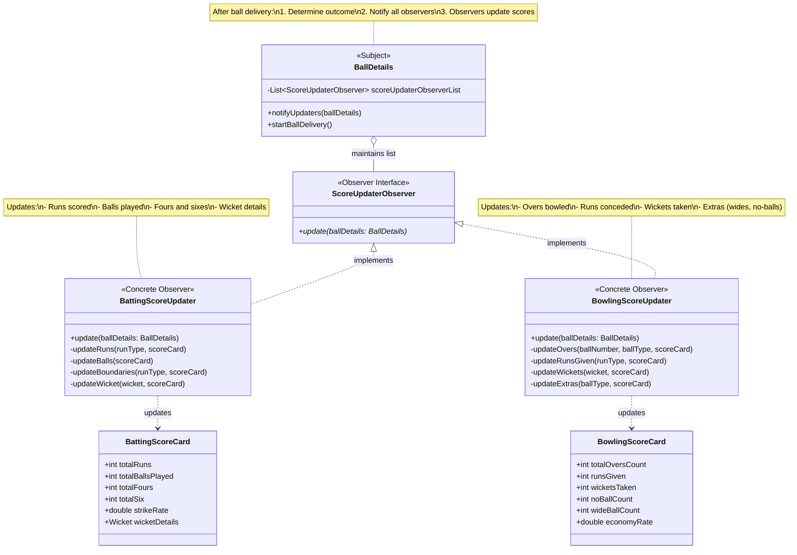

---

## 11. Design Patterns Summary

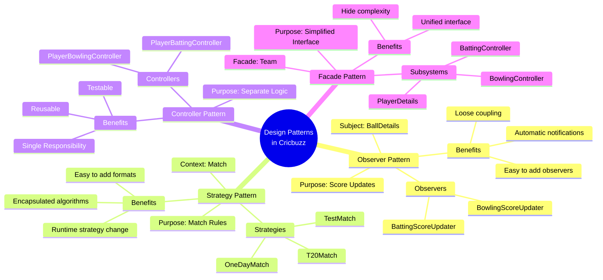

---
