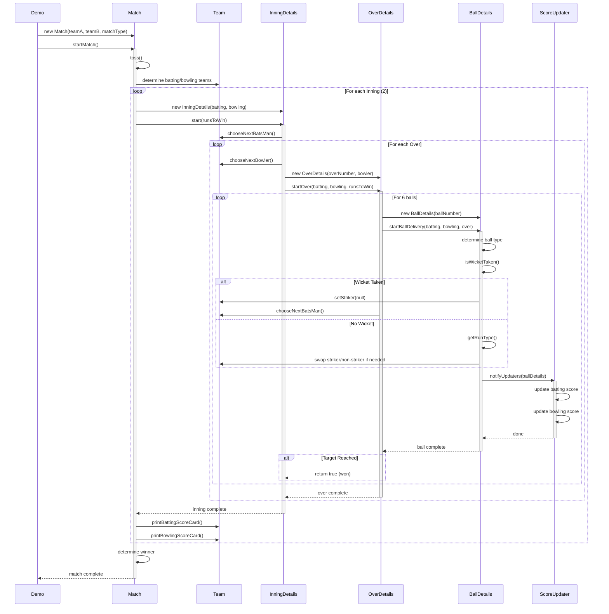
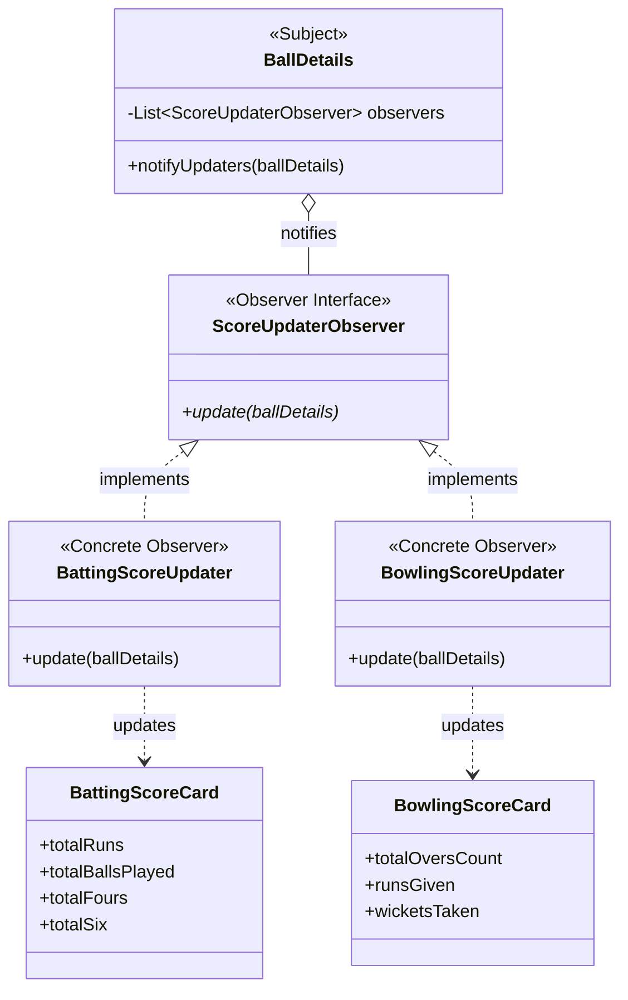
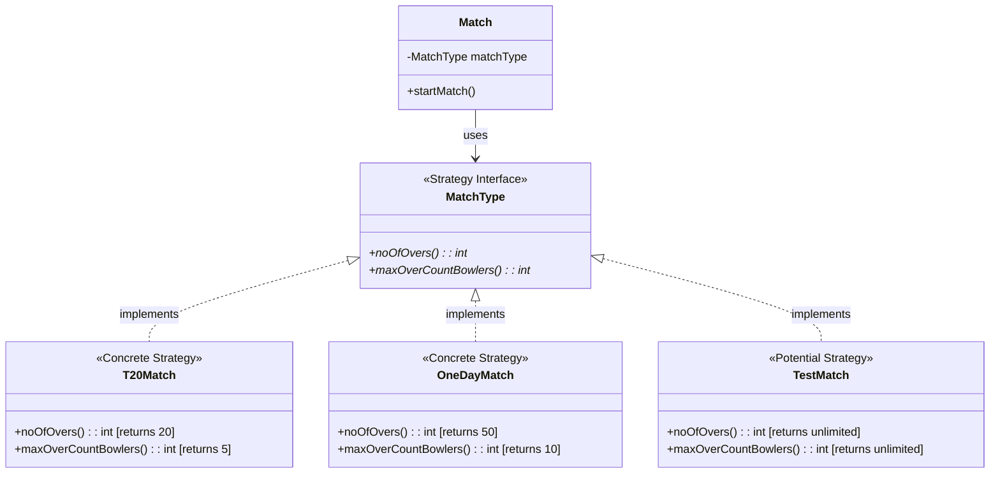
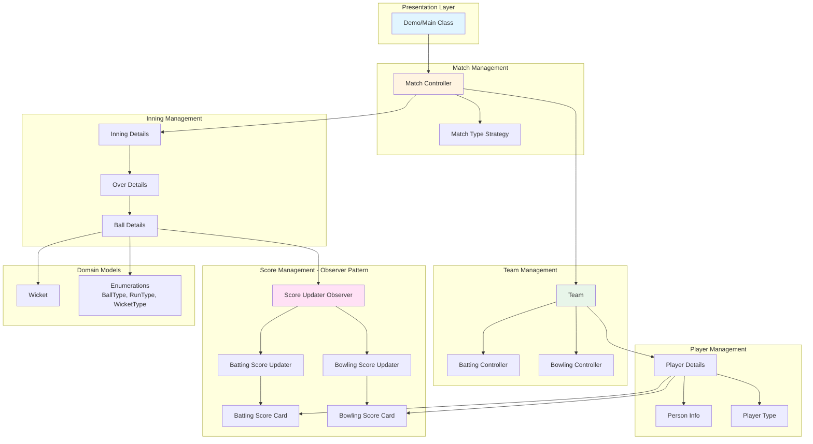
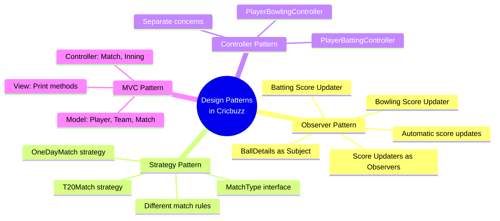

# Cricbuzz Cricket Match Simulation - Complete UML Documentation

## Functional Requirements

### 1. Match Management
**FR1.1**: System shall support multiple match formats (T20, ODI, Test)  
**FR1.2**: System shall conduct a toss to determine batting/bowling teams  
**FR1.3**: System shall manage two innings per match  
**FR1.4**: System shall determine and announce the winner based on runs scored  
**FR1.5**: System shall track match metadata (date, venue, teams)

### 2. Team Management
**FR2.1**: Each team shall have 11 playing players and bench players  
**FR2.2**: System shall maintain batting order through a queue structure  
**FR2.3**: System shall manage bowling rotation with over limits per bowler  
**FR2.4**: System shall prevent a bowler from bowling consecutive overs  
**FR2.5**: System shall track and display team scorecards (batting and bowling)

### 3. Player Management
**FR3.1**: Each player shall have personal details (name, age, address)  
**FR3.2**: System shall support different player types (Batsman, Bowler, All-rounder, Wicketkeeper, Captain)  
**FR3.3**: Each player shall maintain separate batting and bowling statistics  
**FR3.4**: System shall calculate and display strike rate for batsmen (runs/balls × 100)  
**FR3.5**: System shall calculate and display economy rate for bowlers (runs/overs)

### 4. Inning Management
**FR4.1**: Each inning shall consist of a configurable number of overs (based on match type)  
**FR4.2**: System shall enforce maximum overs per bowler based on match format  
**FR4.3**: Second inning shall track target runs (first inning runs + 1)  
**FR4.4**: Inning shall end when all overs are completed or all players are out  
**FR4.5**: System shall track total runs scored per inning

### 5. Over and Ball Management
**FR5.1**: Each over shall consist of exactly 6 legal deliveries  
**FR5.2**: System shall support ball types: Normal, Wide Ball, No Ball  
**FR5.3**: System shall randomly determine ball outcomes (wicket or runs)  
**FR5.4**: System shall support run types: 0, 1, 2, 3, 4, 6  
**FR5.5**: System shall swap batsmen after odd runs (1 or 3)  
**FR5.6**: System shall swap batsmen at the end of each over

### 6. Wicket Management
**FR6.1**: System shall simulate wickets with 20% probability  
**FR6.2**: System shall support wicket types: Bowled, Caught, Run Out  
**FR6.3**: System shall track which player took the wicket  
**FR6.4**: System shall track in which over and on which ball the wicket occurred  
**FR6.5**: System shall bring the next batsman when a wicket falls

### 7. Score Management
**FR7.1**: System shall update batting scores in real-time after each ball  
**FR7.2**: System shall update bowling scores in real-time after each ball  
**FR7.3**: System shall track: runs, balls played, fours, sixes for batsmen  
**FR7.4**: System shall track: overs bowled, runs given, wickets, extras for bowlers  
**FR7.5**: System shall automatically calculate strike rates and economy rates

### 8. Display and Reporting
**FR8.1**: System shall print detailed batting scorecard for each team  
**FR8.2**: System shall print detailed bowling scorecard for each team  
**FR8.3**: System shall display individual player statistics  
**FR8.4**: System shall announce match winner with final scores

---

## Non-Functional Requirements

### 1. Design Quality
**NFR1.1**: System shall follow SOLID principles throughout the codebase  
**NFR1.2**: System shall implement Observer pattern for automatic score updates  
**NFR1.3**: System shall implement Strategy pattern for different match types  
**NFR1.4**: System shall implement Controller pattern for team management  
**NFR1.5**: System shall maintain loose coupling between components

### 2. Maintainability
**NFR2.1**: Code shall be modular with clear separation of concerns  
**NFR2.2**: Each class shall have a single, well-defined responsibility  
**NFR2.3**: System shall be easily extensible for new features without modifying existing code  
**NFR2.4**: Code shall follow standard Java naming conventions

### 3. Testability
**NFR3.1**: Components shall be independently testable in isolation  
**NFR3.2**: System shall support mocking for comprehensive unit tests  
**NFR3.3**: Observer pattern shall allow isolated testing of score updates  
**NFR3.4**: Controllers shall be testable without creating full team objects

### 4. Extensibility
**NFR4.1**: System shall allow adding new match formats without modifying existing code  
**NFR4.2**: System shall allow adding new observers (e.g., commentary, statistics) easily  
**NFR4.3**: System shall support adding new player types and wicket types  
**NFR4.4**: System architecture shall support future database integration

### 5. Reusability
**NFR5.1**: Controllers shall be reusable across different team implementations  
**NFR5.2**: Observer implementations shall be reusable for different subjects  
**NFR5.3**: Match type strategies shall be reusable across multiple matches

---

## Objectives

### Primary Objectives
**OBJ1.1**: Implement Observer Pattern for automatic real-time score updates  
**OBJ1.2**: Implement Strategy Pattern for flexible match format rules  
**OBJ1.3**: Implement Controller Pattern for separated team management logic  
**OBJ1.4**: Simulate realistic cricket match flow from toss to winner declaration

### Design Objectives
**OBJ2.1**: Create a scalable architecture supporting multiple match formats  
**OBJ2.2**: Achieve high modularity with clear component boundaries  
**OBJ2.3**: Follow SOLID principles (especially Single Responsibility and Open/Closed)  
**OBJ2.4**: Demonstrate practical implementation of design patterns  
**OBJ2.5**: Build loosely coupled, highly cohesive components

### Quality Objectives
**OBJ3.1**: Ensure accurate score calculations and state management  
**OBJ3.2**: Achieve high code maintainability and readability  
**OBJ3.3**: Create comprehensive and clear UML documentation  
**OBJ3.4**: Enable easy testing through proper abstraction

### Educational Objectives
**OBJ4.1**: Illustrate SOLID principles in a real-world scenario  
**OBJ4.2**: Provide reference implementation for design patterns  
**OBJ4.3**: Show effective use of object-oriented programming concepts  
**OBJ4.4**: Demonstrate separation of concerns in complex systems

---

## Design Patterns Used

### Observer Pattern (Implemented)

**Purpose**: Automatic score update mechanism. When a ball is delivered, all score observers are automatically notified and update their respective scorecards.

**Problem Statement**:
* **Challenge**: Ball delivery needs to update multiple scorecards (batting, bowling, potentially others)
* **Issue**: Direct coupling between ball and scorecards makes system rigid
* **Solution**: Observer pattern decouples ball delivery from score updates

**Implementation**:
* **Subject**: `BallDetails` (notifies when ball is delivered)
* **Observer Interface**: `ScoreUpdaterObserver` (defines update contract)
* **Concrete Observers**: `BattingScoreUpdater`, `BowlingScoreUpdater`
* **State Objects**: `BattingScoreCard`, `BowlingScoreCard`

**How it works**:

```java
// Ball delivery triggers automatic updates
public void startBallDelivery(Team battingTeam, Team bowlingTeam, OverDetails over) {
    // Determine ball outcome
    this.ballType = BallType.NORMAL;
    this.playedBy = battingTeam.getStriker();
    this.bowledBy = bowlingTeam.getCurrentBowler();
    
    if (isWicketTaken()) {
        this.runType = RunType.ZERO;
        this.wicket = new Wicket(WicketType.BOLD, bowledBy, over, this);
    } else {
        this.runType = getRunType();
    }
    
    // Automatically notify all observers
    notifyUpdaters(this);
}

// Observer pattern notification
private void notifyUpdaters(BallDetails ballDetails) {
    for (ScoreUpdaterObserver observer : scoreUpdaterObserverList) {
        observer.update(ballDetails);
    }
}
```

**Benefits**:
* ✅ **Decoupling**: Ball delivery doesn't know about scorecards
* ✅ **Extensibility**: Easy to add new observers (commentary, statistics, live feed)
* ✅ **Automatic Updates**: All observers notified automatically
* ✅ **Single Responsibility**: Each observer handles one type of update
* ✅ **Open/Closed**: Add observers without modifying BallDetails

---

### Strategy Pattern (Implemented)

**Purpose**: Support different cricket match formats (T20, ODI, Test) with different rules, allowing runtime selection of match type.

**Problem Statement**:
* **Client**: Match orchestrator needs different rules for different formats
* **Challenge**: T20 (20 overs, 5 max/bowler), ODI (50 overs, 10 max/bowler), Test (unlimited)
* **Issue**: Hard-coding rules makes system inflexible
* **Solution**: Strategy pattern encapsulates format-specific rules

**Implementation**:
* **Context**: `Match` (uses match type strategy)
* **Strategy Interface**: `MatchType` (defines rule methods)
* **Concrete Strategies**: `T20Match`, `OneDayMatch`, `TestMatch`

**How it works**:

```java
// Strategy interface
public interface MatchType {
    int noOfOvers();
    int maxOverCountBowlers();
}

// T20 strategy
public class T20Match implements MatchType {
    @Override
    public int noOfOvers() { return 20; }
    
    @Override
    public int maxOverCountBowlers() { return 5; }
}

// ODI strategy
public class OneDayMatch implements MatchType {
    @Override
    public int noOfOvers() { return 50; }
    
    @Override
    public int maxOverCountBowlers() { return 10; }
}

// Usage in Match
Match match = new Match(teamA, teamB, new T20Match());
int totalOvers = match.matchType.noOfOvers(); // Returns 20 for T20
```

**Benefits**:
* ✅ **Flexibility**: Change match format at runtime
* ✅ **Encapsulation**: Each format's rules are self-contained
* ✅ **Open/Closed**: Add new formats without modifying existing code
* ✅ **Single Responsibility**: Each strategy handles one format's rules
* ✅ **Extensibility**: Easy to add T10, The Hundred, etc.

---

### Controller Pattern (Implemented)

**Purpose**: Separate complex batting and bowling management logic from the Team class, achieving better separation of concerns.

**Problem Statement**:
* **Challenge**: Team needs to manage batting order and bowling rotation
* **Issue**: Putting all logic in Team class violates Single Responsibility
* **Solution**: Dedicated controllers for batting and bowling management

**Implementation**:
* **Facade**: `Team` (delegates to controllers)
* **Controllers**: `PlayerBattingController`, `PlayerBowlingController`
* **Managed Objects**: `PlayerDetails` (players)

**How it works**:

```java
// Team delegates to controllers
public class Team {
    private PlayerBattingController battingController;
    private PlayerBowlingController bowlingController;
    
    public void chooseNextBatsMan() {
        battingController.getNextPlayer();
    }
    
    public void chooseNextBowler(int maxOverCount) {
        bowlingController.getNextBowler(maxOverCount);
    }
}

// Batting Controller manages batting order
public class PlayerBattingController {
    private Queue<PlayerDetails> yetToPlay;
    private PlayerDetails striker;
    private PlayerDetails nonStriker;
    
    public void getNextPlayer() {
        if (striker == null) {
            striker = yetToPlay.poll();
        } else {
            nonStriker = yetToPlay.poll();
        }
    }
}

// Bowling Controller manages bowling rotation
public class PlayerBowlingController {
    private Deque<PlayerDetails> bowlersList;
    private Map<PlayerDetails, Integer> bowlerVsOverCount;
    
    public void getNextBowler(int maxOverCount) {
        // Rotate bowlers while respecting over limits
        PlayerDetails bowler = bowlersList.poll();
        if (bowlerVsOverCount.get(bowler) < maxOverCount) {
            currentBowler = bowler;
            bowlersList.addLast(bowler);
        }
    }
}
```

**Benefits**:
* ✅ **Separation of Concerns**: Team doesn't handle rotation logic
* ✅ **Single Responsibility**: Each controller has one job
* ✅ **Testability**: Controllers testable independently
* ✅ **Reusability**: Controllers reusable across teams
* ✅ **Maintainability**: Complex logic isolated and manageable

---

### Real-World Analogies

**Observer Pattern**:
* **Breaking News**: News agency (subject) → Multiple news channels (observers)
* **Stock Market**: Stock price change (subject) → Multiple trading apps (observers)
* **Social Media**: User posts (subject) → Followers get notifications (observers)

**Strategy Pattern**:
* **Payment Methods**: Shopping cart (context) → Credit card/PayPal/Cash (strategies)
* **Transportation**: Trip planner (context) → Car/Train/Flight (strategies)
* **Sorting**: Data processor (context) → QuickSort/MergeSort/BubbleSort (strategies)

**Controller Pattern**:
* **Traffic Control**: City (facade) → Traffic controllers (controllers) → Vehicles (managed)
* **Restaurant**: Restaurant (facade) → Kitchen/Service controllers → Staff (managed)
* **Airport**: Airport (facade) → Ground/Air traffic controllers → Aircraft (managed)

---

## UML Diagrams

### 1. Complete System - Class Diagram

```mermaid
classDiagram
    class Demo {
        +main(args: String[])$
        -addTeam(name: String): Team
        -addPlayer(name: String, type: PlayerType): PlayerDetails
    }
    
    class Match {
        -Team teamA
        -Team teamB
        -Date matchDate
        -String venue
        -Team tossWinner
        -InningDetails[] innings
        -MatchType matchType
        +Match(teamA, teamB, matchDate, venue, matchType)
        +startMatch()
        -toss(teamA, teamB): Team
    }
    
    class MatchType {
        <<interface>>
        +noOfOvers(): int*
        +maxOverCountBowlers(): int*
    }
    
    class T20Match {
        +noOfOvers(): int
        +maxOverCountBowlers(): int
    }
    
    class OneDayMatch {
        +noOfOvers(): int
        +maxOverCountBowlers(): int
    }
    
    class Team {
        +String teamName
        +Queue~PlayerDetails~ playing11
        +List~PlayerDetails~ bench
        +PlayerBattingController battingController
        +PlayerBowlingController bowlingController
        +boolean isWinner
        +Team(teamName, playing11, bench, bowlers)
        +chooseNextBatsMan()
        +chooseNextBowler(maxOverCount)
        +getStriker(): PlayerDetails
        +getCurrentBowler(): PlayerDetails
        +getTotalRuns(): int
        +printBattingScoreCard()
        +printBowlingScoreCard()
    }
    
    class InningDetails {
        -Team battingTeam
        -Team bowlingTeam
        -MatchType matchType
        -List~OverDetails~ overs
        +InningDetails(battingTeam, bowlingTeam, matchType)
        +start(runsToWin)
        +getTotalRuns(): int
    }
    
    class OverDetails {
        -int overNumber
        -List~BallDetails~ balls
        -int extraBallsCount
        -PlayerDetails bowledBy
        +OverDetails(overNumber, bowledBy)
        +startOver(battingTeam, bowlingTeam, runsToWin): boolean
    }
    
    class BallDetails {
        +int ballNumber
        +BallType ballType
        +RunType runType
        +PlayerDetails playedBy
        +PlayerDetails bowledBy
        +Wicket wicket
        -List~ScoreUpdaterObserver~ scoreUpdaterObserverList
        +BallDetails(ballNumber)
        +startBallDelivery(battingTeam, bowlingTeam, over)
        -notifyUpdaters(ballDetails)
        -getRunType(): RunType
        -isWicketTaken(): boolean
    }
    
    class PlayerDetails {
        +Person person
        +PlayerType playerType
        +BattingScoreCard battingScoreCard
        +BowlingScoreCard bowlingScoreCard
        +PlayerDetails(person, playerType)
        +printBattingScoreCard()
        +printBowlingScoreCard()
    }
    
    class Person {
        +String name
        +int age
        +String address
    }
    
    class PlayerBattingController {
        -Queue~PlayerDetails~ yetToPlay
        -PlayerDetails striker
        -PlayerDetails nonStriker
        +PlayerBattingController(playing11)
        +getNextPlayer()
        +getStriker(): PlayerDetails
        +setStriker(player)
        +getNonStriker(): PlayerDetails
        +setNonStriker(player)
    }
    
    class PlayerBowlingController {
        -Deque~PlayerDetails~ bowlersList
        -Map~PlayerDetails,Integer~ bowlerVsOverCount
        -PlayerDetails currentBowler
        +PlayerBowlingController(bowlers)
        -setBowlersList(bowlers)
        +getNextBowler(maxOverCount)
        +getCurrentBowler(): PlayerDetails
    }
    
    class ScoreUpdaterObserver {
        <<interface>>
        +update(ballDetails: BallDetails)*
    }
    
    class BattingScoreUpdater {
        +update(ballDetails: BallDetails)
    }
    
    class BowlingScoreUpdater {
        +update(ballDetails: BallDetails)
    }
    
    class BattingScoreCard {
        +int totalRuns
        +int totalBallsPlayed
        +int totalFours
        +int totalSix
        +double strikeRate
        +Wicket wicketDetails
    }
    
    class BowlingScoreCard {
        +int totalOversCount
        +int runsGiven
        +int wicketsTaken
        +int noBallCount
        +int wideBallCount
        +double economyRate
    }
    
    class Wicket {
        +WicketType wicketType
        +PlayerDetails takenBy
        +OverDetails overDetail
        +BallDetails ballDetail
        +Wicket(wicketType, takenBy, overDetail, ballDetail)
    }
    
    class BallType {
        <<enumeration>>
        NORMAL
        WIDEBALL
        NOBALL
    }
    
    class RunType {
        <<enumeration>>
        ZERO
        ONE
        TWO
        THREE
        FOUR
        SIX
    }
    
    class PlayerType {
        <<enumeration>>
        BATSMAN
        BOWLER
        WICKETKEEPER
        CAPTAIN
        ALLROUNDER
    }
    
    class WicketType {
        <<enumeration>>
        RUNOUT
        BOLD
        CATCH
    }
    
    %% Relationships
    Demo ..> Match : creates
    Demo ..> Team : creates
    Match o-- Team : has 2
    Match o-- InningDetails : has 2
    Match --> MatchType : uses
    MatchType <|.. T20Match : implements
    MatchType <|.. OneDayMatch : implements
    
    InningDetails o-- Team : batting/bowling
    InningDetails o-- OverDetails : contains many
    InningDetails --> MatchType : uses
    
    OverDetails o-- BallDetails : contains 6
    OverDetails --> Team : uses
    
    BallDetails --> BallType : uses
    BallDetails --> RunType : uses
    BallDetails o-- Wicket : may have
    BallDetails o-- ScoreUpdaterObserver : notifies
    
    Team *-- PlayerBattingController : has
    Team *-- PlayerBowlingController : has
    Team o-- PlayerDetails : has 11
    
    PlayerBattingController o-- PlayerDetails : manages
    PlayerBowlingController o-- PlayerDetails : manages
    
    PlayerDetails *-- Person : has
    PlayerDetails --> PlayerType : is a
    PlayerDetails *-- BattingScoreCard : has
    PlayerDetails *-- BowlingScoreCard : has
    
    BattingScoreCard o-- Wicket : may have
    
    Wicket --> WicketType : uses
    Wicket --> PlayerDetails : taken by
    Wicket --> OverDetails : in
    Wicket --> BallDetails : on
    
    ScoreUpdaterObserver <|.. BattingScoreUpdater : implements
    ScoreUpdaterObserver <|.. BowlingScoreUpdater : implements
    BattingScoreUpdater ..> BattingScoreCard : updates
    BowlingScoreUpdater ..> BowlingScoreCard : updates
```



---

### 2. Sequence Diagram - Complete Match Flow



---

### 3. Observer Pattern - Score Update Flow



---

### 4. Strategy Pattern - Match Type



---

### 5. System Architecture - Component View



---

### 6. Match State Flow

```mermaid
stateDiagram-v2
    [*] --> MatchCreated: new Match()
    MatchCreated --> TossCompleted: toss()
    
    TossCompleted --> Inning1Start: Start Inning 1
    
    state Inning1Start {
        [*] --> BatsmanSelected: choose batsmen
        BatsmanSelected --> OverStart: choose bowler
        
        state OverStart {
            [*] --> Ball1
            Ball1 --> Ball2
            Ball2 --> Ball3
            Ball3 --> Ball4
            Ball4 --> Ball5
            Ball5 --> Ball6
            Ball6 --> [*]
            
            Ball1 --> WicketCheck: after each ball
            WicketCheck --> NextBatsman: if wicket
            WicketCheck --> Ball2: no wicket
            NextBatsman --> Ball2
        }
        
        OverStart --> NextOver: 6 balls complete
        NextOver --> OverStart: more overs
        NextOver --> [*]: all overs done
    }
    
    Inning1Start --> Inning1Complete
    Inning1Complete --> Inning2Start: Start Inning 2
    
    state Inning2Start {
        [*] --> ChasingTarget
        ChasingTarget --> OverStart2: overs
        OverStart2 --> TargetCheck: after each ball
        TargetCheck --> [*]: target reached
        TargetCheck --> OverStart2: continue
        OverStart2 --> [*]: all overs done
    }
    
    Inning2Start --> Inning2Complete
    Inning2Complete --> DetermineWinner
    DetermineWinner --> MatchEnded
    MatchEnded --> [*]
```



---

### 7. Design Patterns Used



---
